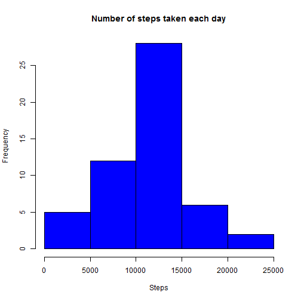
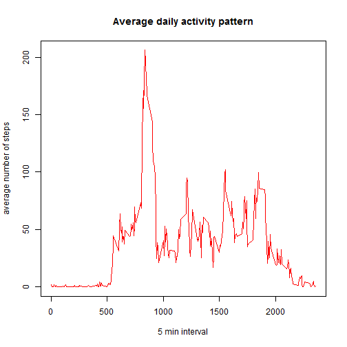
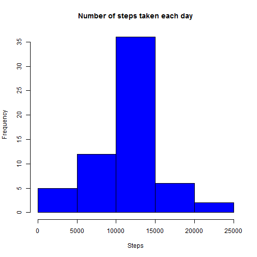
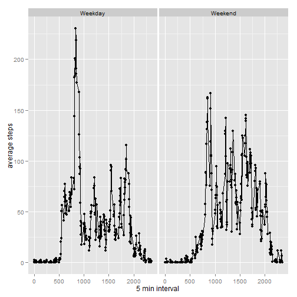

**Loading and preprocessing the data**
======================================


```r
## Read the data file 
library(ggplot2)
```

```
## Warning: package 'ggplot2' was built under R version 3.0.3
```

```r
activity <- read.csv("activity.csv")

head(activity)
```

```
##   steps       date interval
## 1    NA 2012-10-01        0
## 2    NA 2012-10-01        5
## 3    NA 2012-10-01       10
## 4    NA 2012-10-01       15
## 5    NA 2012-10-01       20
## 6    NA 2012-10-01       25
```

```r
summary(activity)
```

```
##      steps               date          interval   
##  Min.   :  0.0   2012-10-01:  288   Min.   :   0  
##  1st Qu.:  0.0   2012-10-02:  288   1st Qu.: 589  
##  Median :  0.0   2012-10-03:  288   Median :1178  
##  Mean   : 37.4   2012-10-04:  288   Mean   :1178  
##  3rd Qu.: 12.0   2012-10-05:  288   3rd Qu.:1766  
##  Max.   :806.0   2012-10-06:  288   Max.   :2355  
##  NA's   :2304    (Other)   :15840
```


```r
## Remove missing values 'NA'
activitycompact <- subset(activity, activity$steps != 'NA')

## Aggregate the data by date
activitybydate <- aggregate(activitycompact$steps,by=list(activitycompact$date),FUN=sum)

## Rename headers
names(activitybydate) <- c("date","steps")
```
**What is mean total number of steps taken per day?**

- Make a histogram of the total number of steps taken each day


```r
## Plot the histogram
hist(activitybydate$steps, col="blue", main ="Number of steps taken each day", 
      xlab="Steps", ylab="Frequency")
```

 
- Calculate and report the mean and median total number of steps taken per day


```r
## Calculate the mean
mean(activitybydate$steps,na.rm=TRUE)
```

```
## [1] 10766
```

```r
## Calculate the median
median(activitybydate$steps,na.rm=TRUE)
```

```
## [1] 10765
```

**What is the average daily activity pattern?**


```r
## Activity by Interval Mean
activitybyinterval <- aggregate(activitycompact$steps,by=list(activitycompact$interval),FUN=mean)

## Rename headers
names(activitybyinterval) <- c("interval","steps")
```

- Make a time series plot (i.e. type = "l") of the 5-minute interval (x-axis) and the average number of steps taken, averaged across all days (y-axis)


```r
## Time series plot
plot(activitybyinterval$steps ~ activitybyinterval$interval, type = "l", 
    col="red", main = "Average daily activity pattern", 
    xlab="5 min interval",ylab="average number of steps")
```

 

- Which 5-minute interval, on average across all the days in the dataset, contains the maximum number of steps?

```r
subset(activitybyinterval, activitybyinterval$steps == max(activitybyinterval$steps))
```

```
##     interval steps
## 104      835 206.2
```

**Imputing missing values**

- Calculate and report the total number of missing values in the dataset (i.e. the total number of rows with NAs)


```r
nrow(activity[activity$steps == 'NA',])
```

```
## [1] 2304
```

- Devise a strategy for filling in all of the missing values in the dataset. The strategy does not need to be sophisticated. For example, you could use the mean/median for that day, or the mean for that 5-minute interval, etc.Create a new dataset that is equal to the original dataset but with the missing data filled in.


```r
activityfilled <- merge(x=activity,y=activitybyinterval,by.x="interval",by.y="interval")

names(activityfilled) <- c("interval","steps","date","stepsperinterval")

for (i in 1:nrow(activityfilled))
{ if (is.na(activityfilled[i,]$steps)) {activityfilled[i,2] = activityfilled[i,4]}
}
```

- Make a histogram of the total number of steps taken each day and Calculate and report the mean and median total number of steps taken per day. Do these values differ from the estimates from the first part of the assignment? What is the impact of imputing missing data on the estimates of the total daily number of steps?


```r
activityfilledbydate <- aggregate(activityfilled$steps,by=list(activityfilled$date),FUN=sum)

names(activityfilledbydate) <- c("date","steps")

hist(activityfilledbydate$steps, col="blue", main ="Number of steps taken each day", 
     xlab="Steps", ylab="Frequency")
```

 


```r
## Calculate the mean
mean(activityfilledbydate$steps,na.rm=TRUE)
```

```
## [1] 10766
```

```r
## Calculate the median
median(activityfilledbydate$steps,na.rm=TRUE)
```

```
## [1] 10766
```

no notable impact on the mean and median already calculated with missing values.

**Are there differences in activity patterns between weekdays and weekends?**

- Create a new factor variable in the dataset with two levels - "weekday" and "weekend" indicating whether a given date is a weekday or weekend day.


```r
activityfilled$date <- as.Date(activityfilled$date)
activityfilled$day <- weekdays(activityfilled$date)
for (i in 1:nrow(activityfilled)) 
{ 
  if(activityfilled[i,5] == "Saturday") { activityfilled$daylevel[i] = "Weekend"} 
  else if (activityfilled[i,5] == "Sunday") {activityfilled$daylevel[i] = "Weekend"} 
  else {activityfilled$daylevel[i] = "Weekday"} 
}
activityfilled$daylevel <- factor(activityfilled$daylevel)
```


- Make a panel plot containing a time series plot (i.e. type = "l") of the 5-minute interval (x-axis) and the average number of steps taken, averaged across all weekday days or weekend days (y-axis). The plot should look something like the following, which was creating using simulated data:


```r
activityfilledbyday <- aggregate(activityfilled$steps,by=list(activityfilled$interval,activityfilled$daylevel),FUN=mean)
names(activityfilledbyday) <- c("interval","daylevel","steps")

qplot(activityfilledbyday$interval,activityfilledbyday$steps, data = activityfilledbyday,facets = .~daylevel, xlab = "5 min interval", ylab= "average steps") +geom_line() 
```

 
